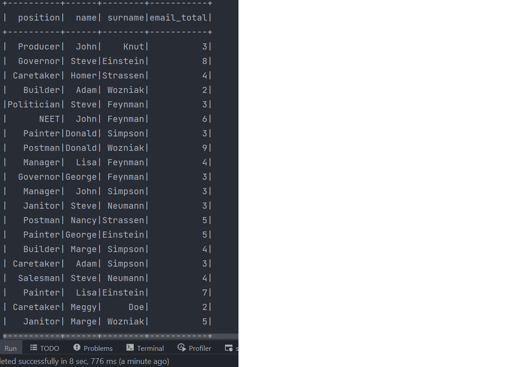
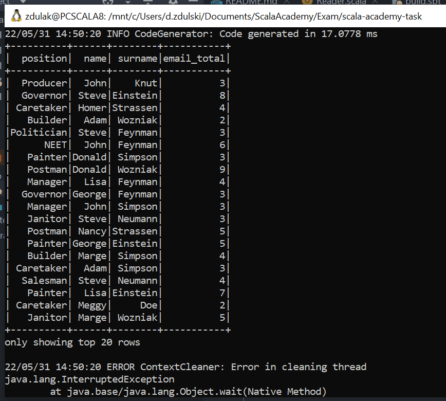

# exam-bug-fix

There is no bug in this application!  
I have run it using Intellij, sbt run in the Windows terminal and sbt run in the WSL. In all cases everything was alright. Below, I attach photos with the results to confirm my words. Maybe there was problem with wrong version of java or scala. I use jdk 11.

  

